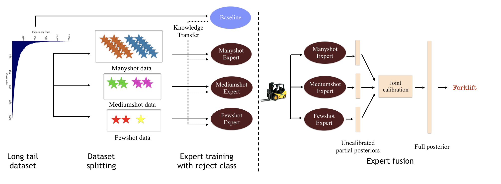

## class-balanced-experts

Code for our GCPR 20 Paper: Long-Tailed Recognition Using Class-Balanced Experts, available here: https://arxiv.org/abs/2004.03706



## Dependencies
* python 3.7
* pytorch 1.2.0
* matplotlib 3.1.0

## Setup
1. Clone this repository.
2. Download the [ImageNet](http://image-net.org/download.php) and [Places](http://places2.csail.mit.edu/download.html) datasets, and update the path in utils.py/data_root.
3. Download the ImageNet pretrained caffe model provided by Liu et al from [Google Drive](https://drive.google.com/uc?export=download&id=0B7fNdx_jAqhtckNGQ2FLd25fa3c) and place it in ./data/caffe_resnet152.pth

## Running the Code

For training, first train the general models:
```
python main.py --batch_size 512 --exp [imagenet_base_exp] --dataset ImageNet --picker generalist --lr 0.2 --seed 5021 --scheduler cosine --max_epochs 100

python main.py --batch_size 64 --exp [places_base_exp] --dataset Places --picker generalist --lr 0.01 --seed 5021 --scheduler stepLR --step_size 10 --gamma 0.1 --max_epochs 60 
```
Then, train the expert models:
```
python main.py --exp [imagenet_manyshot_exp] --open_ratio 16 --picker experts --low_threshold 100 --load_model ./checkpoint/imagenet_base_exp/best_model.pt --seed 5021 --stopping_criterion 15 --batch_size 256 --scheduler stepLR --gamma 0.1 --step_size 10 --lr 0.1

python main.py --exp [imagenet_mediumshot_exp] --num_learnable 3 --open_ratio 16 --picker experts --low_threshold 20 --high_threshold 100 --load_model ./checkpoint/imagenet_base_exp/best_model.pt --seed 5021 --stopping_criterion 15 --batch_size 256 --scheduler stepLR --gamma 0.1 --step_size 10 --lr 0.1

python main_ensemble.py --exp [imagenet_fewshot_exp] --num_learnable 1 --open_ratio 16 --picker experts --high_threshold 20 --load_model ./checkpoint/imagenet_base_exp/best_model.pt --seed 5021 --stopping_criterion 15 --batch_size 256 --scheduler cosine --max_epochs 60 --lr 0.1
```
```
python main.py --exp [places_manyshot_exp] --open_ratio 16 --picker experts --low_threshold 100 --load_model ./checkpoint/places_base_exp/best_model.pt --seed 5021 --stopping_criterion 15 --dataset Places --batch_size 32 --scheduler stepLR --gamma 0.1 --step_size 10 --lr 0.01

python main.py --exp [places_mediumshot_exp] --num_learnable 3 --open_ratio 8 --picker experts --low_threshold 20 --high_threshold 100 --load_model ./checkpoint/places_base_exp/best_model.pt --seed 5021 --stopping_criterion 15 --dataset Places --batch_size 32 --scheduler stepLR --gamma 0.1 --step_size 10 --lr 0.01

python main.py --exp [places_fewshot_exp] --num_learnable 3 --open_ratio 8 --picker experts --high_threshold 20 --load_model ./checkpoint/places_base_exp/best_model.pt --seed 5021 --stopping_criterion 15 --dataset Places --batch_size 32 --scheduler stepLR --gamma 0.1 --step_size 10 --lr 0.01
```

For testing, first generate the logit scores for each expert model on each data_split:
```
python gen_logits.py --exp [imagenet_logits] --dataset ImageNet --load_model [path_to_the_model] --model_name [manyshot|mediumshot|fewshot|general] --data_split [train|val|test_aligned] 

python gen_logits.py --exp [places_logits] --dataset Places --load_model [path_to_the_model] --model_name [manyshot|mediumshot|fewshot|general] --data_split [train|val|test_aligned] 
```
Train the joint calibration module:
```
python jointCalibration.py --exp [imagenet_jointCalibration_exp] --logit_exp [imagenet_logits] --dataset Imagenet
python jointCalibration.py --exp [places_jointCalibration_exp] --logit_exp [places_logits] --dataset Places
```
Test the joint calibration module to generate four-fold accuracies on Many/Medium/Few/All splits:
```
python jointCalibration.py --exp [imagenet_jointCalibration_exp] --dataset Imagenet --test --load_model ./checkpoint/imagenet_jointCalibration_exp/best_model.pt
python jointCalibration.py --exp [places_jointCalibration_exp] --dataset Places --test --load_model ./checkpoint/places_jointCalibration_exp/best_model.pt
```
## Pre-trained model

We provide pre-trained expert and jointCalibration models on [Google Drive](https://drive.google.com/file/d/1m6bVVms1Q54AbxrG_EE8vvzDVFVQ-JgO/view?usp=sharing). You can reproduce our results by generating the logit scores using the expert models, and evaluating using the jointCalibration model. 

## Code 

The code for the base ResNet models is taken from this repository for Liu et al's CVPR 19 paper Large-Scale Long-Tailed Recognition in an Open World: https://github.com/zhmiao/OpenLongTailRecognition-OLTR. 

## Citing 

If you use this code, please cite our work : 
```
@article{sharma2020long,
  title={Long-Tailed Recognition Using Class-Balanced Experts},
  author={Sharma, Saurabh and Yu, Ning and Fritz, Mario and Schiele, Bernt},
  journal={arXiv preprint arXiv:2004.03706},
  year={2020}
}
```
